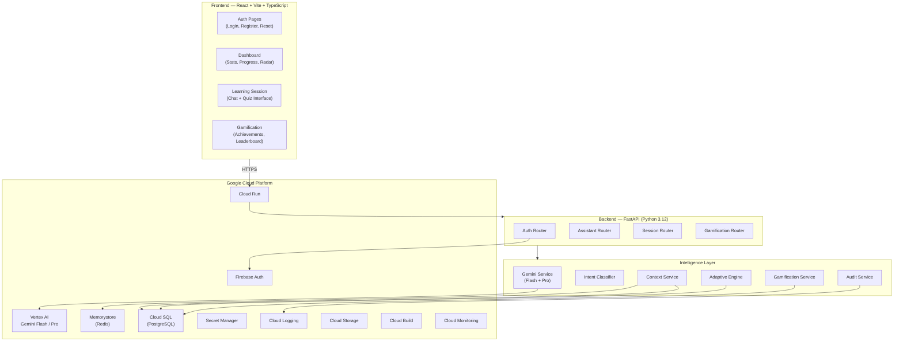

# LearnAI — Intelligent Adaptive Learning Assistant

> An AI-powered learning assistant that personalizes educational content, adapts to each learner's pace and understanding, and uses gamification to motivate continuous growth.

## Vertical

**Education** — Personalized AI tutoring with adaptive difficulty and gamified progress tracking.

## Approach and Logic

LearnAI implements a **7-stage Context Pipeline** that ensures every AI interaction is context-aware, validated, and auditable — never a blind LLM passthrough.

### Decision-Making Pipeline

```
User Message
│
▼
[1] Intent Classification ← Gemini Flash: classify → learn | quiz | explain | summarize | clarify
│
▼
[2] Context Enrichment ← Pull session history (Redis), topic mastery (Cloud SQL)
│
▼
[3] Prompt Construction ← System prompt with enriched context + difficulty level + safety bounds
│
▼
[4] Gemini Inference ← Flash (real-time chat) or Pro (complex reasoning)
│
▼
[5] Response Validation ← Safety filter check, hallucination signals, format validation
│
▼
[6] Structured Output ← Typed response + XP award + achievement check + mastery update
│
▼
[7] Audit Log ← Intent, model, tokens, latency → Cloud Logging
```

**Key Decision Rules:**
- **Confidence gating**: If the classifier returns < 60% confidence, the system asks for clarification instead of guessing.
- **Model selection**: Flash for chat/classification (low latency), Pro only for multi-step reasoning (logged).
- **Adaptive difficulty**: Tracks per-topic accuracy. ≥80% correct → promote difficulty. ≤40% → demote. Minimum 3 answers before adjusting.
- **Graceful degradation**: If Gemini API is unavailable, returns a structured fallback response — never a raw exception.

## How the Solution Works

### Architecture



### User Flow

1. **Authenticate** — User signs in via Google OAuth or email/password (Firebase Auth)
2. **Start Learning** — Select a topic or ask any question in the chat interface
3. **Intent Classification** — Gemini Flash classifies the input (learn/quiz/explain/summarize/clarify)
4. **Context Enrichment** — System pulls session history from Redis + topic mastery from Cloud SQL
5. **Adaptive Response** — Gemini generates a response tailored to the user's current difficulty level
6. **Gamification** — XP is awarded, achievements are checked, streak is updated
7. **Mastery Tracking** — Quiz results update per-topic mastery scores for the skill radar chart
8. **Audit** — Every interaction is logged with intent, model, tokens, and latency to Cloud Logging

### Gamification System

| Mechanic | Details |
|----------|---------|
| **XP Points** | +10/message, +25/quiz correct, +50/session complete, +5/daily login. Scales with difficulty (1.0x–2.0x). |
| **Levels** | `Level = floor(sqrt(totalXP / 100)) + 1`. Level 1=0XP, Level 2=100XP, Level 5=1600XP. |
| **Streaks** | Consecutive daily logins. 1-day grace period. Visual fire indicator with multiplier at 7/30 days. |
| **Achievements** | 15+ badges: First Lesson, Quiz Master, 7-Day Streak, Topic Expert, Speed Learner, etc. |
| **Leaderboard** | Global ranking by XP. Current user position always shown. |
| **Mastery** | Per-topic 0–100 score based on quiz accuracy. Radar chart visualization. |

### Google Services Used

| # | Service | Purpose |
|---|---------|---------|
| 1 | **Vertex AI — Gemini Flash** | Intent classification, real-time chat, content generation, quiz creation |
| 2 | **Vertex AI — Gemini Pro** | Complex multi-step reasoning, in-depth explanations |
| 3 | **Firebase Auth** | Google OAuth 2.0, email/password auth, password reset, ID token verification |
| 4 | **Cloud SQL (PostgreSQL)** | Users, learning sessions, messages, gamification data, topic mastery |
| 5 | **Cloud Run** | Serverless container hosting with auto-scaling (1–20 instances) |
| 6 | **Secret Manager** | Runtime injection of all credentials and API keys |
| 7 | **Memorystore (Redis)** | Session memory (sliding window), response cache, rate limit counters |
| 8 | **Cloud Logging** | Structured JSON audit logs: intent, model, tokens, latency |
| 9 | **Cloud Build** | CI/CD: lint → test-unit → test-integration → build → push → deploy |
| 10 | **Cloud Storage** | User-uploaded study materials and exported session transcripts |

## Technology Stack

| Layer | Technology |
|-------|-----------|
| **Frontend** | React 19, TypeScript, Vite, Zustand, React Router |
| **Styling** | Claymorphism design system (CSS custom properties, Baloo 2 + Comic Neue fonts) |
| **Backend** | FastAPI, Python 3.12, SQLAlchemy 2.x (async), Pydantic v2 |
| **Database** | PostgreSQL (Cloud SQL), Redis (Memorystore) |
| **Auth** | Firebase Admin SDK (server), Firebase Client SDK (frontend) |
| **AI** | Vertex AI Gemini API (Flash + Pro models) |
| **CI/CD** | Cloud Build → Cloud Run |
| **Testing** | pytest + pytest-asyncio (unit/integration), Playwright (E2E) |

## Assumptions

- Uses Google Cloud Platform in `asia-south1` region
- Requires a Firebase project with Email/Password + Google sign-in enabled
- Firebase Admin SDK credentials provided as Base64-encoded service account JSON
- Gemini API access via Vertex AI (project must have the API enabled)
- Local development uses Docker Compose for PostgreSQL and Redis
- The assistant can teach any topic — Gemini generates content dynamically
- Leaderboard is global (no per-topic filtering in v1)

## Local Development Setup

```bash
# Clone and set up
git clone https://github.com/<your-org>/promptwars
cd promptwars
cp .env.example .env  # Fill in your GCP project values and Firebase config

# Install backend dependencies
python -m venv venv
source venv/bin/activate  # Windows: venv\Scripts\activate
pip install -r requirements-dev.txt

# Install frontend dependencies
cd frontend && npm install && cd ..

# Start infrastructure (Postgres + Redis)
docker-compose up -d

# Run backend
uvicorn api.main:app --reload --port 8000

# Run frontend (separate terminal)
cd frontend && npm run dev

# Run tests
pytest tests/unit -q --cov=api
pytest tests/integration -q
cd frontend && npx tsc --noEmit
```

### Environment Variables

See [`.env.example`](.env.example) for all required variables. Key ones:

| Variable | Description |
|----------|-------------|
| `GCP_PROJECT_ID` | Google Cloud project ID |
| `FIREBASE_CREDENTIALS_BASE64` | Base64-encoded Firebase service account JSON |
| `VITE_FIREBASE_API_KEY` | Firebase web API key (for frontend) |
| `POSTGRES_*` | Database connection details |
| `REDIS_HOST` | Redis connection host |

## Deployment

### Cloud Run (Production)

```bash
# Build and deploy via Cloud Build
gcloud builds submit --config=cloudbuild.yaml

# Or manual deploy
docker build -t gcr.io/$PROJECT_ID/learnai-api .
docker push gcr.io/$PROJECT_ID/learnai-api
gcloud run deploy learnai-api \
  --image gcr.io/$PROJECT_ID/learnai-api \
  --region asia-south1 \
  --platform managed \
  --allow-unauthenticated \
  --max-instances 20
```

### CI/CD Pipeline

The `cloudbuild.yaml` runs on every push to `main`:
1. **Lint** — `ruff check api/`
2. **Unit Tests** — `pytest tests/unit` with coverage
3. **Integration Tests** — `pytest tests/integration`
4. **Frontend Build** — TypeScript check + Vite build
5. **Docker Build** — Multi-stage (Node → Python)
6. **Deploy** — Push to GCR → Deploy to Cloud Run

## Testing

```bash
# Unit tests with coverage
pytest tests/unit -q --tb=short --cov=api --cov-report=term-missing

# Integration tests
pytest tests/integration -q --tb=short

# All tests
pytest tests/ -q

# Frontend type check
cd frontend && npx tsc --noEmit
```

### Test Coverage

| Layer | Files | Tests |
|-------|-------|-------|
| **Unit** | `test_intent_service.py` | 12 tests — intent parsing, confidence gating, fallback |
| **Unit** | `test_adaptive_engine.py` | 27 tests — XP calc, leveling, difficulty adjustment |
| **Unit** | `test_gamification_service.py` | 20 tests — XP awards, streaks, achievement criteria |
| **Integration** | `test_auth_routes.py` | 11 tests — register, login, reset, /me, health |
| **Integration** | `test_assistant_routes.py` | 9 tests — chat, quiz, evaluate endpoints |
| **Integration** | `test_gamification_routes.py` | 9 tests — profile, achievements, leaderboard, mastery |

## Project Structure

```
promptwars/
├── api/
│   ├── main.py                 # App entry, CORS, router registration
│   ├── config.py               # pydantic-settings, Secret Manager
│   ├── routers/                # auth, assistant, sessions, gamification
│   ├── services/
│   │   ├── gemini_service.py   # Vertex AI Gemini API calls
│   │   ├── intent_service.py   # Intent classification pipeline
│   │   ├── context_service.py  # Context enrichment (DB + Redis)
│   │   ├── adaptive_engine.py  # Difficulty scaling, XP calculation
│   │   ├── gamification_service.py  # XP, streaks, achievements
│   │   └── audit_service.py    # Structured Cloud Logging
│   ├── repositories/           # DB access layer (user, session, gamification)
│   ├── models/                 # SQLAlchemy ORM models
│   ├── schemas/                # Pydantic request/response schemas
│   ├── db/                     # Session factory, migrations
│   └── utils/                  # auth, logging, rate_limit, cache
├── frontend/
│   ├── src/
│   │   ├── pages/              # Login, Register, Dashboard, Learn, etc.
│   │   ├── components/         # Layout, ProtectedRoute, etc.
│   │   ├── hooks/              # useAuth
│   │   ├── services/           # firebase.ts, api.ts
│   │   ├── store/              # authStore (Zustand)
│   │   └── constants/          # strings, routes, theme
│   └── public/
├── tests/
│   ├── conftest.py             # Shared fixtures (mock auth, DB, client)
│   ├── unit/                   # Service-level tests
│   └── integration/            # Route-level tests with TestClient
├── .env.example                # All required environment variables
├── Dockerfile                  # Multi-stage (Node + Python)
├── docker-compose.yml          # Local dev: API + Postgres + Redis
├── cloudbuild.yaml             # CI/CD: lint → test → build → deploy
├── requirements.txt            # Production dependencies
├── requirements-dev.txt        # Test/dev dependencies
└── README.md                   # This file
```

## License

Apache-2.0 — See [LICENSE](LICENSE) for details.
